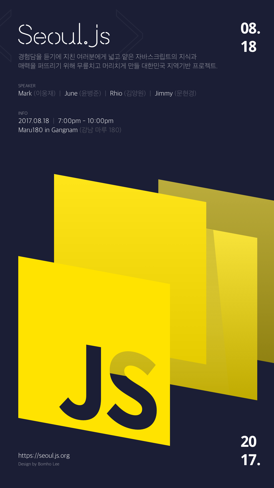

  

## Schedule

- Date: 2017.08.18 (Friday Night)
- Time: 7:00pm - 10:00pm
- Place: [Maru180](http://www.maru180.com/) in Gangnam, [Google Map](https://goo.gl/maps/5VKLahT7oYK2), [Naver Map](http://naver.me/x5NbCJUs)
- [Registration](https://onoffmix.com/event/108442)

<table>
  <thead>
    <tr>
      <th>Time</th>
      <th>Schedules</th>
      <th></th>
      <th></th>
    </tr>
  </thead>
  <tbody>
    <tr>
      <td>7:00pm</td>
      <td colspan="3">Registration</td>
    </tr>
    <tr>
      <td rowspan="2">7:20pm</td>
      <td>ES2017 (ES8) 소개 (Introduce ECMAScript® 2017 Language Specification)</td>
      <td>@june</td>
      <td>30m</td>
    </tr>
    <tr>
      <td colspan="3">
        <a href="https://poll.now.sh/poll/-KpuAIFDSW8CJdMQ_VxT/ES2017%20(ES8)%20%EC%86%8C%EA%B0%9C%20(Introduce%20ECMAScript%C2%AE%202017%20Language%20Specification)/vote">vote: </a>
      </td>
    </tr>
    <tr>
      <td rowspan="2">7:50pm</td>
      <td>일렉트론에서 자바스크립트 소스 코드 보호하기 (Protecting Javascript Source Code in Electron)</td>
      <td>@2woongjae</td>
      <td>30m</td>
    </tr>
    <tr>
      <td colspan="3">
        <a href="https://poll.now.sh/poll/-KpuAIFDSW8CJdMQ_VxT/%EC%9D%BC%EB%A0%89%ED%8A%B8%EB%A1%A0%EC%97%90%EC%84%9C%20%EC%9E%90%EB%B0%94%EC%8A%A4%ED%81%AC%EB%A6%BD%ED%8A%B8%20%EC%86%8C%EC%8A%A4%20%EC%BD%94%EB%93%9C%20%EB%B3%B4%ED%98%B8%ED%95%98%EA%B8%B0%20(Protecting%20Javascript%20Source%20Code%20in%20Electron)/vote">vote: </a>
      </td>
    </tr>
    <tr>
      <td>8:20pm</td>
      <td colspan="3">Break & Advertisement</td>
    </tr>
    <tr>
      <td rowspan="2">8:30pm</td>
      <td>문서화에 날개를 달아주는 Flybook CLI - Static Web Site Generator</td>
      <td>@rhiokim</td>
      <td>30m</td>
    </tr>
    <tr>
      <td colspan="3">
        <a href="https://poll.now.sh/poll/-KpuAIFDSW8CJdMQ_VxT/Flybook%20%EC%9D%84%20%EC%9D%B4%EC%9A%A9%ED%95%B4%20%EB%AC%B8%EC%84%9C%ED%99%94%EC%97%90%20%EB%82%A0%EA%B0%9C%EB%A5%BC%20%EB%8B%AC%EC%9E%90.%20(Flybook%20CLI%20-%20Static%20Web%20Site%20Generator)/vote">vote: </a>
      </td>
    </tr>
    <tr>
      <td rowspan="2">9:00pm</td>
      <td>새로운 자바스크립트 개발 도구의 시대 (Zero-Configuration Tooling)</td>
      <td>@ragingwind</td>
      <td>30m</td>
    </tr>
    <tr>
      <td colspan="3">
        <a href="https://poll.now.sh/poll/-KpuAIFDSW8CJdMQ_VxT/%EC%83%88%EB%A1%9C%EC%9A%B4%20%EC%9E%90%EB%B0%94%EC%8A%A4%ED%81%AC%EB%A6%BD%ED%8A%B8%20%EA%B0%9C%EB%B0%9C%20%EB%8F%84%EA%B5%AC%EC%9D%98%20%EC%8B%9C%EB%8C%80%20(Zero-Configuration%20Tooling)/vote">vote: </a>
      </td>
    </tr>
    <tr>
      <td>9:30pm</td>
      <td colspan="3">Ending & Enjoy Friday Night</td>
    </tr>
  </tbody>
</table>

### ES2017 (ES8) 소개
자바스크립트의 표준이라고 할 수 있는 ECMAScript는 7년만에 발표한 2015년의 ES6를 시작으로 매년 새로운 버전을 출시되고 있습니다. 올해도 어김없이 새로운 버전의 ECMAScript가 발표되었습니다.

지난 6월에 릴리즈된 ECMAScript 2017(ES8)에 어떤 기능(feature)이 추가되었는지 살펴보고, 이전의 ECMAScript에 있던 유사한 기능과는 어떤 차이점이 있는지 비교해 보려고 합니다.

### 일렉트론에서 자바스크립트 소스 코드 보호하기
일렉트론을 프로덕션 레벨에서 사용하기 위해, 비지니스 로직에 대한 소스 보호가 필요합니다.
일렉트론 자체적으로 제공하는 방법은 없기 때문에 우회해서 보호를 해야합니다.

상용 프로그램인 프로토파이에서 소스를 보호한 방법을 소개하고, 간단하게 소스가 보호된 일렉트론 앱을 만들어보겠습니다.

### 문서화에 날개를 달아주는 Flybook CLI
대부분의 성숙하고 잘 알려진 프로젝트라고 하면 따라오는 것이 문서화입니다.
더불어 개발자들에게 고통과 번거러움을 동반하는 것 역시 문서화입니다.

Flybook은 이러한 문서화의 고통을 해소 시켜보고자 시작한 Node 기반의 CLI 도구이고 이 발표에서는 Flybook을 이용해 손쉽게 문서화를 할 수 있는 방법들과 CI 툴과 연동하여 문서를 자동으로 생성하는 몇가지 편리한 활용법을 이야기하려고 합니다.

### 새로운 자바스크립트 개발 도구의 시대
자바스크립트를 사용하는 개발환경에서 보일러플레이트/툴링이라는 단어가 아직은 모두에게 생소하던 시절부터 자바스크립트 개발 도구 오픈소스에 참여하면서 겪은 경험담과 도구들의 특징과 기능들에 대해서 공유합니다.

그리고 현재 트렌드로 여겨지는 Zero Configuration Tooling 의 특/장점을 알아보고 앞으로 어떤 도구들을 사용할 것인지 알아보고자 합니다.

## Speakers

#### ES2017 (ES8) 소개 (Introduce ECMAScript® 2017 Language Specification)

  
   <a href="https://github.com/onyoon7/">June (윤병준)</a>

비전공자로 프로그래밍 부트캠프를 통해 개발을 시작하였다. Angular 로컬라이제이션과 ’국민투표로또’ 프로젝트를 리딩하였고, 현재는 React/Redux를 이용하여 E-commerce 쇼핑몰을 만들고 있다.

자바스크립트의 기본과 프레임워크의 발전에 관심이 많으며, 기술을 통해 조금이나마 세상에 선한 영향력을 끼치고 싶은 소망을 품고 있다.

#### 일렉트론에서 자바스크립트 소스 코드 보호하기 (Protecting Javascript Source Code in Electron)

  
   <a href="https://github.com/2woongjae/">Mark Lee (이웅재)</a>

Node-Webkit 부터 시절부터 웹기술로 데스크탑 어플리케이션을 만들었다. 일렉트론과 NW.JS 를 사용하여 가상터치 솔루션을 적용한 스마트 티비, 스마트 홈 및 디지털 사이니지용 소프트웨어를 만들었다.

현재는 TypeScript 와 Electron 을 이용하여, 디자이너를 위한 인터렉션 프로토타이핑 툴인 프로토파이를 만들고 있다. 대규모 자바스크립트 어플리케이션 개발에 대한 더 나은 방향을 고민하고, 적용하기 위해 노력하고 있다.

#### 문서화에 날개를 달아주는 Flybook CLI - Static Web Site Generator

  
   <a href="https://github.com/rhiokim/">Rhio Kim (김양원)</a>

2007년 자바스크립트를 시작해서 2012년부터 자바스크립트를 이용해 다양한 프로젝트 Haroopad, Gorae, Gona, Flybook 그리고 Flypoll 등을 깃헙에서 진행중이다.

새로운 자바스크립 기술에 늘 목마르고 새로운 아이디어를 실현하고 함께 나누것에 늘 목말라 있다. 그리고 현재는 티티카카 개발자로 그 목마름을 조금 해소하고 있다

#### 새로운 자바스크립트 개발 도구의 시대 (Zero-Configuration Tooling)

  
   <a href="https://github.com/ragingwind/">Jimmy (문현경)</a>

자바스크립트 툴링 문화를 이끌었던 Yeoman 오픈소스 프로젝트의 코어팀 멤버로 활동하면서 그 동안 다양한 프레임워크의 베스트 프렉틱스와 보일러플레이트 연구하면서 여러가지 다양한 자바스크립트 툴링 프로젝트에 참여하고 플러그인을 개발/유지보수 했다.

현재는 React/React Native 솔루션/앱 개발과 Progressive Web Apps 개발에 집중하고 있으며 대외적으로는 구글 데벨로퍼 익스퍼트(GDE) 와 코드버스킹 테크 매거진 에디터로 활동 중이다. ZEIT! 팬으로 알려지고 싶어한다.

  <a href="https://onoffmix.com/event/108442">Registration</a>

<!--br/>
 
 
 
 
 

## Review (After Meetup)

### Session 1

### Session 2

### Session 3

## Voting for Session 4
-->