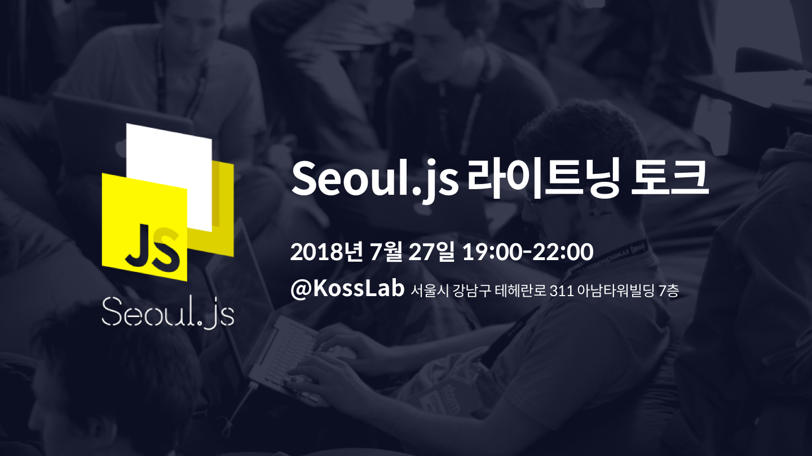

  

# Seoul.js Lightning Talk

이번 Seoul.js 라이트닝 토크는 Javascript에 관심을 갖는 네트워크 중심의 이벤트 입니다.

Seoul.js에서 서울의 Javascript 개발자들과 신나게 JS 토크를 나누는 것은 물론, 함께 서로를 알아갈 수 있는 네트워킹 이벤트를 개최합니다.

국내의 개발 이벤트는 몇몇 실력있는 개발자들이 발표를 하고, 참가자들은 발표만 듣고 별도의 네트워킹이 바로 뿔뿔이 흩어지는 경향이 있습니다. 이왕 다들 한 자리에 모였는데, 서로 무엇에 관심이 있고 어떤 걸 개발하는 지 등을 이야기하며 네트워킹할 수 있는 자리가 있으면 더 좋을텐데, 이 부분이 늘 아쉬웠습니다.

이러한 취지로 다가오는 Seoul.js 라이트닝 토크에서는 네트워킹 중심의 이벤트를 열려고 합니다.  ‘라이트한' 방식으로 JS 개발자라면 누구나 즐길 수 있고 참여할 수 있는 행사를 준비했습니다.

## 라이트닝 토크

발표는 각각 5분 내외로 짧게 진행됩니다. JS 개발에 관한 자신만의 경험담이나 인사이트가 있는 사람이라면,  누구나 부담없이 발표자로 참여할 수 있습니다. 발표자가 많을 수록 지식 공유뿐만 아니라 관심사나 생각, 고민 등을 서로 공유할 수 있다는 점에서 아이스 브레이킹인 것이죠. 발표 세션이 끝나면 다 같이 모여 신나고 재밌게 테크 토크를 하는,

개발자의,
개발자에 의한,
개발자를 위한 진정한 네트워킹 시간!

## 참가자

참가자는 총 40명으로, 발표자 14명과 청자 26명으로 구성됩니다.

발표 주제는 Javascript와 관련된 것이라면 무엇이든 가능합니다. 프로젝트 경험담이나 삽질을 통해 알게 된 인사이트, 혹은 현재 구상하는 프로젝트 등 Javascript 개발과 관련만 되어있다면 라이트닝 토크 발표자로 모두 참여 가능해요!

참가자로 오신 분들 중에서도 가볍게 공유하고 싶은 내용이 있는 분들은 이후 네트워킹 타임에 따로 시간을 마련할 예정이니 걱정마세요.

#### 발표 가이드라인

* 경험담, 인사이트, 프로젝트 아이디어 등 **Javascript에 관한 것**이라면 모두 가능  👌
* **5분 내외**로 발표를 할 것
* 슬라이드, 발표자료 준비 등에 대한 압박은 Zero. **형식은 자유롭게!**

#### 발표 주제 예시

* Node Security Platform, nsp, npm audit
* 왜 나는 Redux를 때려치우고 MobX를 쓰게 되었는가
* 개발자도 신경써주었으면 하는 색에 대한 접근성
* P2P Network with Node.js
* React Native에서의 Code push

## 행사 일정

* 일시: 2018년 7월 27일 금요일
* 시간: 오후 7:00 - 10:00
* 장소: [KossLab](https://kosslab.kr/) 서울시 강남구 테헤란로 311 아남타워빌딩 7층

### 이벤트 스케쥴

19:00 - 19:30
19:30 - 20:15  발표 1세션
20:15 - 20:25  인터미션
20:25 - 21:10  발표 2세션
21:10 - 22:00  네트워킹 + 간단한 과자 몇박스 + 음료(캔)

## 참가신청

(링크)로 신청이 가능합니다.

## 문의

문의 사항은 (연락처)로 알려주세요!
